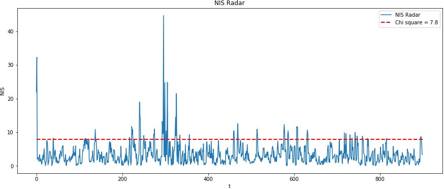

# Unscented_Kalman_Filter

In this project, I implement an Unscented Kalman Filter to estimate the state of multiple cars on a highway using noisy lidar and radar measurements.

The ego vehicle (green) is driving on a highway and estimating position, velocity, orientation and turning rate of other three vehicles (blue) on the road. The traffic cars will be accelerating and altering their steering to change lanes. Each of the traffic cars has
its own UKF object generated for it, and they are being updated every time step.

The red spheres above cars represent the (x,y) lidar detection and the purple lines show the radar measurements with the velocity magnitude along the detected angle.

---

### Important Dependencies
* cmake >= 3.5
  * All OSes: [click here for installation instructions](https://cmake.org/install/)
* make >= 4.1 (Linux, Mac), 3.81 (Windows)
  * Linux: make is installed by default on most Linux distros
  * Mac: [install Xcode command line tools to get make](https://developer.apple.com/xcode/features/)
  * Windows: [Click here for installation instructions](http://gnuwin32.sourceforge.net/packages/make.htm)
* gcc/g++ >= 5.4
  * Linux: gcc / g++ is installed by default on most Linux distros
  * Mac: same deal as make - [install Xcode command line tools](https://developer.apple.com/xcode/features/)
  * Windows: recommend using [MinGW](http://www.mingw.org/)
* PCL 1.2

### Basic Build Instructions

1. Clone this repo.
2. Make a build directory: `mkdir build && cd build`
3. Compile: `cmake .. && make`
4. Run it: `./ukf_highway`

---

## Unscented Kalman Filter

The Unscented Kalman Filter is an extension to the basic Kalman Filter for non-linear systems. It was invented by a group of graduate students who thought the Extended Kalman Filter "stinks" (it is "unscented") because of the poor approximation that the EKF makes for highly non-linear systems.

In contrast to the EKF, the Unscented Kalman filter takes samples (sigma points) from the Gaussian distribution and pass them through the non-linear (process or measurement) model instead of linearizing it using Jacobians.

## Motion Model

The motion model used in this project is the Constant Turn Rate and Velocity magnitude model (CTRV).

This model assumes that objects can move straight with constant velocity and turn with a constant turn rate.

This model is not linear so we need to perform the prediction step in the following way:

* Generate sigma points.
* Predict sigma points using the CTRV model.
* Calculate predicted Mean and Covariance from the sigma points.

## Measurement Model

#### Lidar Update

Lidar updates are performed using normal Kalman Filter equations because lidar measurements in this project give the position (px, py) directly, so it is therefore a linear model and we can update the state using this measurements and the corresponding laser measurement noise.

#### Radar Update

Radar measurement model is not linear so when a radar measurement arrives, the predicted sigma points are passed through the measurement model and compared to the received measurements to update the state of the vehicle.

The complete UKF implementation can be found in `ukf.cpp`.

## Consistency of the filter

The consistency of a filter measures if a Kalman filter’s noise assumptions are consistent with realized measurements. For this, the Normalized Innovation Squared (NIS) is used.

If the measurement noise parameters in a Kalman filter are too small relative to the actual noise, the filter gives too much weight to measurements relative to the process model, underestimating the measurements. On the other hand, if the noise parameter is too large relative to the actual noise, the filter overestimates the measurements.

The INS follows the chi-squared distribution. For example, in radar measurements, statistically 5 % of the cases, the INS will be higher than 7.8 (following chi-squared table). The following graph shows the INS obtained for radar measurements with respect to time:

We should expect the NIS to surpass the red line around 5 % of the cases.
* If the NIS goes above this line too many times, the filter is underestimating the measurements so we should increase the noise variance.
* If the NIS is very low to this threshold and never goes above it, the filter is overestimating the measurements and we should decrease the noise variance.

## Reference
* https://www.seas.harvard.edu/courses/cs281/papers/unscented.pdf
* https://tutcris.tut.fi/portal/files/3250626/KFconsistency2015.pdf
